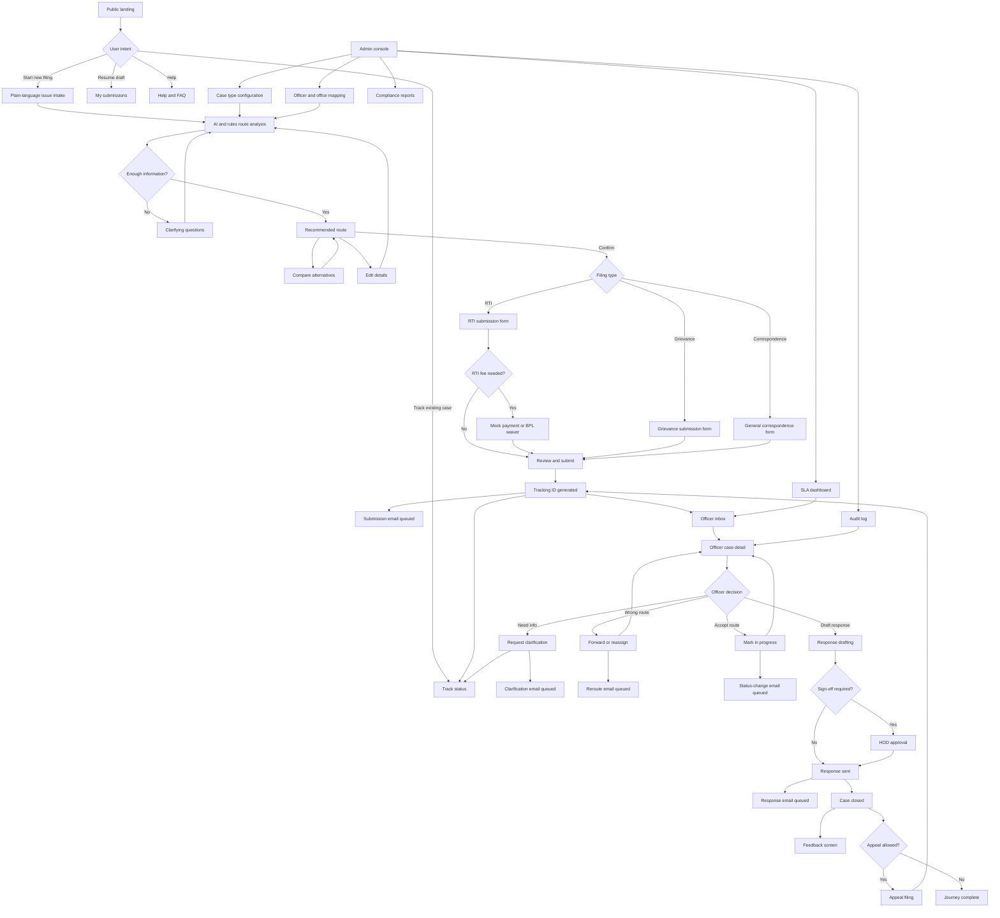
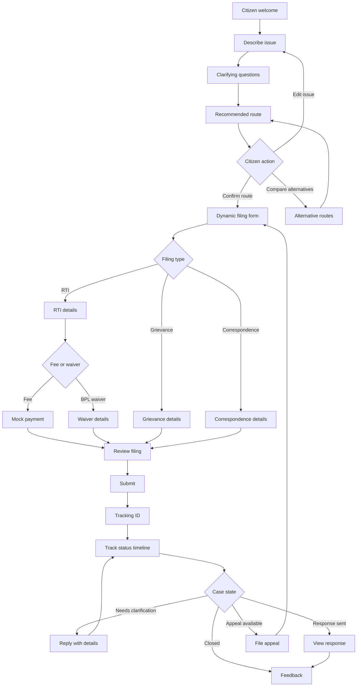
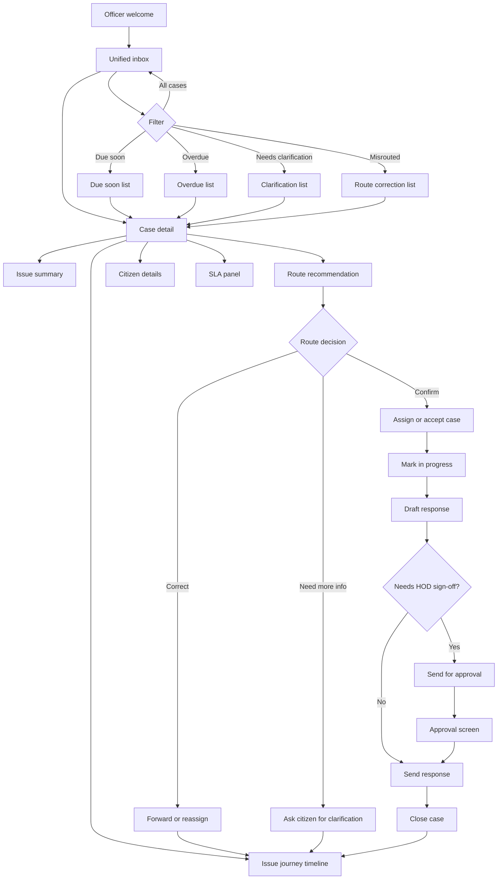
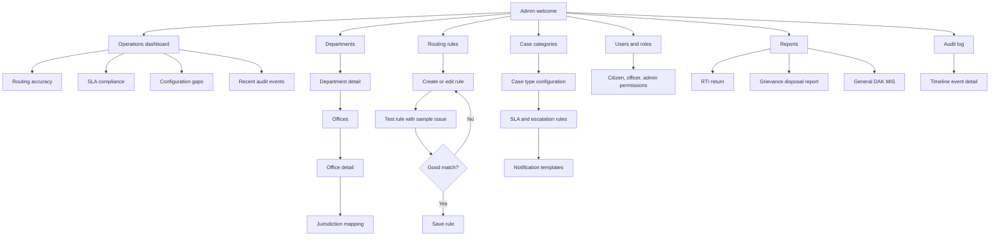
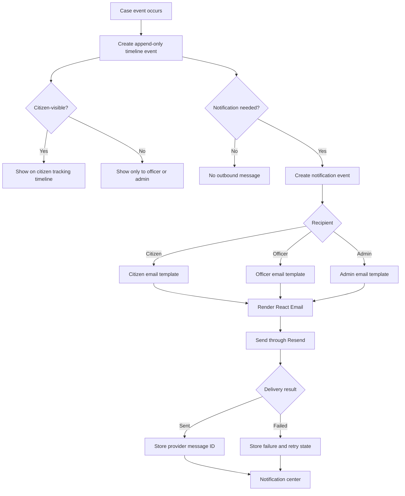
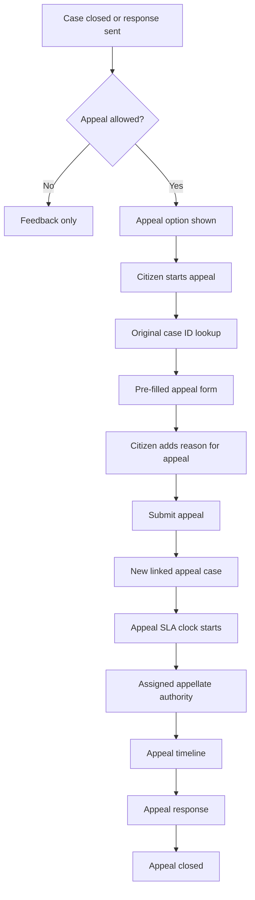

# Screen Flow Chart

This document maps the full CivicRoute prototype screen flow across citizen, officer, admin, timeline, notification, appeal, and compliance journeys.

## Master Product Flow

## Citizen Screen Flow

## Officer Screen Flow

## Admin Screen Flow

## Timeline And Notification Flow

## Appeal Flow

## Screen Inventory

| Area | Screen | Purpose |
|---|---|---|
| Public | Citizen welcome | Start filing, track case, resume draft |
| Public | Plain-language issue intake | Capture issue before asking for department |
| Public | Clarifying questions | Collect location, service, reference number, desired outcome |
| Public | Recommended route | Show filing type, department, office, confidence, and reasoning |
| Public | Alternative routes | Compare likely departments/offices when confidence is low |
| Public | Dynamic filing form | Collect type-specific RTI, grievance, or correspondence details |
| Public | RTI fee or waiver | Mock payment or BPL waiver path |
| Public | Review and submit | Final citizen confirmation before case creation |
| Public | Tracking ID | Confirmation and next step |
| Public | Track status | Citizen-visible timeline and current status |
| Public | Clarification reply | Citizen responds to officer request |
| Public | View response | Citizen sees final response or closure note |
| Public | Feedback | Satisfaction rating after closure |
| Public | Appeal filing | Linked appeal flow after eligible closure |
| Officer | Officer welcome | Daily queue summary |
| Officer | Unified inbox | All assigned RTI, grievance, and correspondence cases |
| Officer | Case detail | Work surface for one case |
| Officer | Route confirmation | Accept, correct, or request more information |
| Officer | Forward or reassign | Move case to another office/officer |
| Officer | Response drafting | Draft reply with type-specific fields |
| Officer | Approval/sign-off | HOD or appellate sign-off where needed |
| Officer | Bulk intake | Manual bridge for physical post, RTI Online, or CPGRAMS items |
| Admin | Admin welcome | System health and operational overview |
| Admin | Departments | Manage ministries, departments, and public authorities |
| Admin | Offices | Manage regional/local office mappings |
| Admin | Jurisdiction mapping | Define which office handles which service/location |
| Admin | Routing rules | Configure and test routing patterns |
| Admin | Case categories | Configure RTI, grievance, correspondence, and appeals |
| Admin | SLA rules | Configure deadlines and escalation triggers |
| Admin | Notification templates | Manage Resend/React Email templates |
| Admin | Users and roles | Manage citizen, officer, admin permissions |
| Admin | Reports | RTI returns, grievance disposal, DAK MIS |
| Admin | Audit log | Immutable event and routing history |
| Shared | Global search | Search by case ID, name, subject, department, or keyword |
| Shared | Notifications center | Status changes, due soon, overdue, clarification requests |
| Shared | Help and FAQ | Plain-language guidance by filing type |

## Demo Path

For a short competition demo, use this path:

```mermaid
flowchart LR
    A[Citizen describes PF issue] --> B[Assistant recommends EPFO grievance]
    B --> C[Citizen confirms and submits]
    C --> D[Tracking ID generated]
    D --> E[Officer sees case]
    E --> F[Officer requests clarification]
    F --> G[Citizen receives email]
    G --> H[Timeline shows where issue went]
    H --> I[Officer marks in progress]
    I --> J[Citizen gets status update]
```

